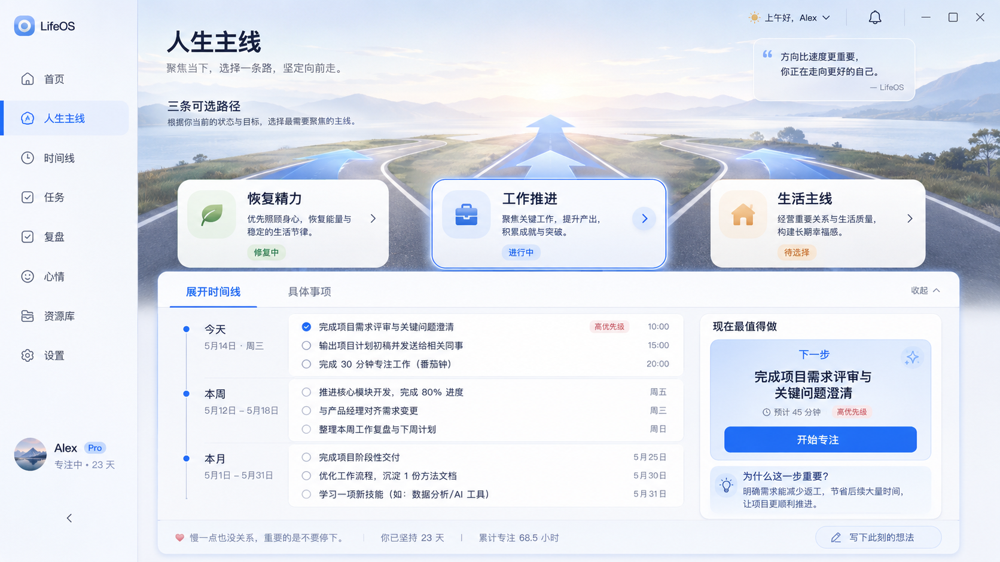

# 所往 SUOWANG

> **行有所往。**

**人生主线导航器**

*A visual mainline navigator for real life.*

**知所往 · 择其径 · 行其事**

所往帮助人在认知余量不足时，仍能快速回答三个问题：

1. 我现在在哪里？
2. 我正在往哪里走？
3. 现在最值得做什么？

它不是 Todo List、目标管理器或 AI 聊天窗口。它把现实状态、候选主线、叙事时间线和下一步行动整理成一个位置稳定、可以长期形成空间记忆的界面。

## 项目起因

最初，我把一张“人生主线驾驶舱”的概念图发给几位朋友，问它能不能在迷茫时提醒方向，也帮助人回顾自己的工作和生活。

有人先说它看起来很高级。更重要的反馈随后来了。人很容易忘记坚持，忙起来或遇到大事时会中断，时间久了，甚至会忘记当初为什么停下。

这几句话把问题说清了，也成为所往的起点。它希望让主线随时可以重新找到。哪怕生活打断过计划，人仍能回来看看自己走到了哪里、准备去哪里，以及眼下最值得做什么。

## 早期概念图



> 这是一张产品方向参考，不是当前实现截图。图中文字、品牌标识与功能均为早期占位，当前产品以 SUOWANG 的文档与真实实现为准。

## 产品机制

```text
知现实
  ↓
择主线
  ↓
行下一步
  ↓
现实变化
  ↓
重新知现实
```

- **知所往**：看清当前状态、约束与几种真正不同的未来方向。
- **择其径**：一次只承诺一条当前主线，并明确选择它意味着暂时放下什么。
- **行其事**：把主线压缩成今天、本周、本月、以后，以及此刻可以开始的一步。

## 核心体验

- 大道与地平线构成主视觉，三条候选路径始终可见。
- 浏览路径不会直接切换主线，承诺必须通过明确操作完成。
- 时间线越近越具体，越远越抽象，避免伪精确计划。
- `现在最值得做` 是页面终点，包含时长、完成定义与低能量降级行动。
- 信息可以变化，核心空间位置保持稳定。
- AI 退居幕后，只负责重新评估路径、解释推荐、调整时间线或下一步。

> 当用户认知能力只剩 30% 时，这个页面仍然必须很好用。

## 当前阶段

项目处于 V0.1 视觉与交互原型阶段。第一目标不是堆叠功能，而是做出一个自己第二天仍愿意打开、别人看到截图就能理解的主线页面。

V0.1 聚焦：

- 大道主视觉与三条未来路径
- 路径详情与显式主线切换
- 当前主线摘要
- 今天 / 本周 / 本月 / 以后叙事时间线
- NOW 卡片与降级行动
- 手动编辑、本地持久化与历史版本
- 桌面、320px、键盘与减少动态效果可用性

首版不包含真实个人数据、自动决策、后台监控、后台通知投递或复杂项目管理。

## 运行视觉原型

需要 Node.js 20 或更新版本。双击 `scripts/start.ps1`，或运行：

```powershell
Set-Location 'A:/2Workspace/Projects/suowang'
npm start
```

打开 `http://127.0.0.1:2037/`。

完整校验：

```powershell
Set-Location 'A:/2Workspace/Projects/suowang'
npm run check
```

原型使用演示内容和浏览器本地存储，不读取真实个人数据，也不连接外部服务。

## 项目原则

- **稳定界面，动态内容**：让人形成空间记忆，而不是每次重新阅读 UI。
- **探索低成本，承诺须显式**：查看一条路不等于选择它。
- **主线意味着取舍**：如果三条路能同时全做，它们只是分类，不是路径。
- **降低行动分辨率，不离开主线**：做不动时缩小动作，而不是制造失败感。
- **AI 是编译器，UI 是编译后的产物**：默认界面不放聊天框。
- **事实、用户输入与推断分层**：推断不能冒充现实事实。
- **项目允许停止**：如果不再产生真实价值，可以冻结、低频维护或归档。

## 开源与许可证

SUOWANG 计划以 [Apache License 2.0](LICENSE) 开源。当前仓库可先保持 Private，达到可展示闸门后再公开：核心页面可运行、README 能解释产品、至少有一张真实截图，并完成基础可用性验证。
