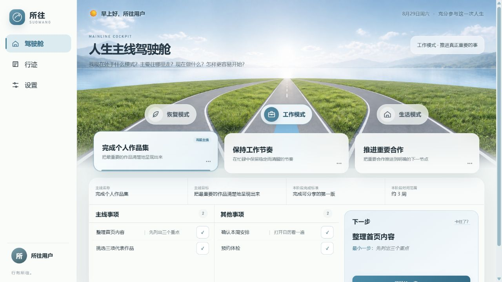

# 所往 SUOWANG

> **行有所往。**

> **知所往 · 择其径 · 行其事。**

**所往是一个本地优先的人生主线驾驶舱。** 它帮助你在脑子很乱的时候，仍然看清自己处于什么模式、当前主要往哪里走，以及现在具体迈哪一步。



## Windows 30 秒开始

`0.2.0-beta.1` 当前是公开 Beta 候选。只有 [GitHub Releases](https://github.com/xhonye/suowang/releases) 出现对应版本后，下面的文件才算正式发布资产。

### 推荐：安装版

1. 下载 `SUOWANG-Setup-0.2.0-beta.1.exe`。
2. 双击安装。
3. 从桌面的「所往 SUOWANG」图标打开。

安装包自带完整桌面运行环境，**不需要 Node.js、npm、命令行或浏览器窗口**。双击后直接打开独立的「所往 SUOWANG」应用。Windows 首次运行未签名测试版时，可能会要求你确认来源。

### 备用：免安装版

下载 `SUOWANG-Portable-0.2.0-beta.1.zip`，解压后双击 `SUOWANG.exe`。不要直接在压缩包内运行。

## 数据只在本机

- 无账号、无云同步、无遥测、无运行时 AI。
- Windows 新安装默认保存在 `%LOCALAPPDATA%/SUOWANG`。
- 应用每天在同一设备自动备份；这能防常见误操作，**不能替代异地备份**。
- 重要数据请定期在设置中“导出 SQLite”，并保存到另一台设备或可信同步位置。
- 反馈问题时不要上传数据库、备份、私人事项或未脱敏截图。

Windows 旧版若已经存在 `D:/5Data/suowang/suowang.db`，会继续使用这个**历史兼容目录**，不会自动搬迁。新用户不会使用该路径；两个目录同时存在数据库时，应用会停止并要求你明确选择，避免错误合并。

## 它解决什么

所往帮助你快速回答四个问题：

1. 我现在处于什么模式？
2. 我当前主要往哪里走？
3. 我现在具体做什么？
4. 如果知道要做却启动不了，怎样把第一步降到足够简单？

产品心智模型只有：

```text
模式 → 主线 → 事项
       ↓
    当前主线
       ↓
     下一步
       ↓
    最小一步（可选）
```

它不是 Todo List、习惯打卡器、完整人生决策系统、项目管理器、KPI 仪表盘、RPG 或 AI 聊天窗口。

## 当前能力

- 恢复、工作、生活三个永久模式，各自记忆当前主线和下一步。
- 每个模式最多三条进行中主线；主线和事项支持创建、编辑、排序、完成、放弃与纠错删除。
- 事项可以填写一个非必填的“最小一步”；下一步可以开始、暂停或完成，不记录时长和专注统计。
- 持续事项每天最多记录一次并保留累计次数，没有连续天数、提醒、积分或缺卡惩罚。
- 行迹保存已完成或放弃的事实；误点的事项可以撤回。
- SQLite migration、每日备份、SQLite 完整导出、JSON 可读导出与整库恢复。
- 桌面与 320px 手机布局；同一 Tailnet 内可选手机访问。

## macOS（实验支持）

仅支持 Apple Silicon（M1 及以后）。下载 `SUOWANG-0.2.0-beta.1-mac-arm64.dmg`，打开后把「所往 SUOWANG」拖入 Applications，再双击打开独立应用窗口。

首个公开 Beta 未签名、未公证。首次打开可能需要按住 Control 点击应用，选择“打开”并再次确认。暂不支持 Intel Mac、App Store 安装或自动更新。

## 使用与反馈

- [Public Beta 使用与测试指南](docs/beta-test-guide.md)
- [简短反馈模板](docs/beta-feedback-template.md)
- [报告 Bug 或提交使用反馈](https://github.com/xhonye/suowang/issues/new/choose)
- [备份、恢复与故障处理](docs/operator-runbook.md)

请先确认问题发生在 GitHub Release 的正式资产中，并附上完整版本号和操作系统。不要发送私人数据库或事项内容。

## 高级使用

### 源码运行

源码路径只支持 Node 22 或 Node 24 LTS：

```powershell
Set-Location -LiteralPath '<path-to-suowang>'
npm install
npm start
```

浏览器打开 `http://127.0.0.1:2037/`。普通用户应优先使用自带 Electron 运行环境的桌面安装包。

开发桌面壳可运行 `npm run desktop:start`；完整桌面门禁为 `npm run test:desktop` 与 `npm run verify:desktop`。浏览器模式和桌面模式共享同一服务、migration、数据库路径与页面。

### npm / 本地 Agent

只有在对应版本已经发布到 npm 后，才使用：

```powershell
npm view suowang@0.2.0-beta.1 version
npm install --ignore-scripts --global suowang@0.2.0-beta.1
suowang install-shortcut
```

本地 Agent 安装时不得读取、移动或覆盖既有 `SUOWANG_DATA_DIR`。仓库权限安装与 CLI 细节见 [本地运维手册](docs/operator-runbook.md)。

### 手机通过 Tailscale 访问

电脑和手机登录同一个 Tailscale 后，在电脑运行：

```powershell
suowang access tailscale
```

该模式只额外监听本机 Tailscale 地址，不监听普通局域网或公网。SUOWANG 没有应用级账号认证，只能供你信任的 Tailnet 设备使用。恢复仅本机模式：

```powershell
suowang access local
```

## 验证与发行边界

```powershell
npm test
npm run test:e2e
npm run smoke:temp
npm run release:check
```

测试使用独立临时数据库和动态端口，不复用个人运行服务。候选安装包必须由同一个完整 commit SHA 构建并通过双平台门禁；人工安装与升级验收完成后，才允许创建不可移动 Tag 和公开 Release。已发布资产禁止覆盖。

## 产品原则与来路

- **稳定界面，动态内容**：形成空间记忆，不必每次重新理解 UI。
- **主线意味着取舍**：同时可以推进几条主线，但此刻只选择一条当前主线。
- **下一步必须清楚**：它是注意力指针，不是新的事项状态。
- **启动入口足够低**：用可选的最小一步降低行动摩擦。
- **本地事实优先**：SQLite 是业务数据唯一真源，AI 只参与造驾驶舱。

> 当用户认知能力只剩 30% 时，这个页面仍然必须很好用。

### 项目起因


### 早期概念图


这张图记录了最初的产品方向，不是当前界面。图中的 Alex、事项和统计均为概念占位；Timeline、NOW 和部分功能已被当前产品合同替换。

## 文档

- [产品模型](docs/product-brief.md)
- [视觉合同](docs/visual-contract.md)
- [架构与数据流](docs/architecture.md)
- [本地接口速查](docs/integration-guide.md)
- [V0.1 实施交接](docs/handoff.md)
- [版本记录](CHANGELOG.md)
- [桌面壳验收状态](DESKTOP_SHELL_READINESS.md)
- [公开发行准备状态](PUBLIC_RELEASE_READINESS.md)
- [第三方依赖声明](THIRD_PARTY_NOTICES.md)
- [安全问题报告](SECURITY.md)

核心技术栈为 Vanilla JS + CSS + Node HTTP + `better-sqlite3`；Electron 仅承担桌面窗口与系统集成。无 React、Vue、Tailwind、ORM、Tauri、云服务、账号、遥测或运行时 AI。

本项目使用 [Apache License 2.0](LICENSE)。
